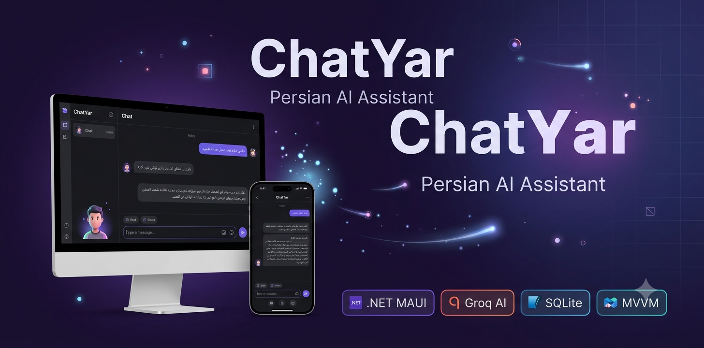
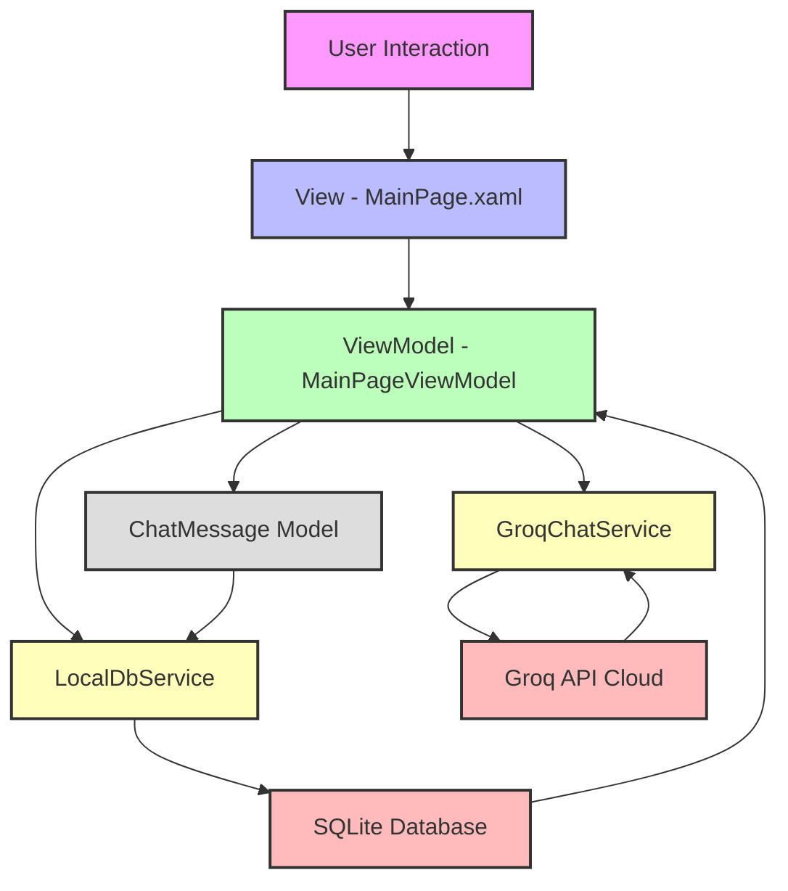

# 🤖 چت‌یار (ChatYar)

<div align="center">

<!-- 🔷 بنر پروژه -->



<br>

### دستیار هوشمند فارسی مبتنی بر هوش مصنوعی

سیستم چت چندسکویی • .NET MAUI • MVVM • SQLite • Groq AI

<br>

<!-- 🔷 Badge ها -->


</div>

---

# 📖 معرفی پروژه

**چت‌یار (ChatYar)** یک دستیار گفت‌وگوی هوشمند فارسی است که با استفاده از **.NET MAUI** توسعه داده شده و از API هوش مصنوعی **Groq** برای تولید پاسخ‌های هوشمند استفاده می‌کند.

این پروژه با معماری **Clean Architecture + MVVM** طراحی شده و تمام مکالمات کاربر به‌صورت محلی با **SQLite** ذخیره می‌شوند.

---


# 📸 تصاویر برنامه

## صفحه اصلی


## محیط چت


## امکانات پیام (لایک / کپی / حذف)


---

# ✨ ویژگی‌ها

* 🇮🇷 پشتیبانی کامل از زبان فارسی (RTL)
* 🤖 پاسخ‌دهی هوشمند با Groq AI
* 💬 ذخیره تاریخچه گفتگوها
* 🗂 پایگاه داده SQLite
* 👍 لایک / دیسلایک پیام‌ها
* 📋 کپی سریع پیام‌ها
* 🌙 رابط کاربری مدرن (Dark Mode)
* ⚡ سرعت بالا و سبک
* 📱 پشتیبانی Android
* 💻 پشتیبانی Windows
* 🍏 پشتیبانی macOS
* 📲 پشتیبانی iOS


---

# 📂 ساختار پروژه

```text
ChatYar/
│
├── 📂 Models/                         # لایه Core - مدل‌های داده
│   └── ChatMessage.cs                 # مدل پیام (ID, Text, IsUser, Timestamp, IsLiked, IsDisliked)
│
├── 📂 Services/                       # لایه Service - منطق کسب‌وکار
│   ├── IChatService.cs                # اینترفیس سرویس چت
│   ├── GroqChatService.cs             # ارتباط با Groq API
│   └── LocalDbService.cs              # عملیات دیتابیس SQLite
│
├── 📂 ViewModels/                     # لایه ViewModel - منطق برنامه
│   └── MainPageViewModel.cs           # مدیریت صفحه اصلی چت
│
├── 📂 Converters/                     # مبدل‌های XAML
│   └── InverseBoolConverter.cs        # معکوس‌کننده Boolean
│
├── 📂 Resources/                      # منابع برنامه
│   ├── Fonts/                         # فونت Vazirmatn
│   ├── Images/                        # تصاویر برنامه
│   └── Styles/                        # استایل‌های UI
│
├── 📂 Platforms/                      # کدهای مختص هر پلتفرم
│   ├── Android/
│   ├── iOS/
│   ├── Windows/
│   └── MacCatalyst/
│
├── 📄 App.xaml                        # نقطه ورودی برنامه
├── 📄 MainPage.xaml                  # صفحه اصلی (XAML)
├── 📄 MauiProgram.cs                  # تنظیمات و تزریق وابستگی
└── 📄 ChatYar.csproj                  # فایل پروژه
```

---
# 📊 دیاگرام معماری

# 🚀 اجرای پروژه

## 1. کلون کردن پروژه

```bash
git clone https://github.com/mm-yazdi/ChatYaar.git
cd ChatYaar
```

## 2. نصب پکیج‌ها

```bash
dotnet restore
```

## 3. اجرای پروژه

```bash
dotnet build
dotnet run
```

---

# 🔑 تنظیم API Key

در فایل زیر:

```
Services/GroqChatService.cs
```

مقدار زیر را جایگزین کنید:

```csharp
YOUR_GROQ_API_KEY
```

---

# 📦 تکنولوژی‌ها

* .NET MAUI
* C#
* XAML
* MVVM Toolkit
* SQLite
* Groq API
* Dependency Injection
* GitHub Actions

---

# 📌 نقشه راه (Roadmap)

* [ ] افزودن پیام صوتی 🎤
* [ ] Streaming پاسخ‌ها ⚡
* [ ] انتخاب مدل‌های مختلف AI
* [ ] تم‌های قابل شخصی‌سازی
* [ ] خروجی گرفتن از چت‌ها
* [ ] Markdown Renderer

---

# 🤝 مشارکت

اگر می‌خواهید مشارکت کنید:

1. Fork کنید
2. Branch بسازید

```bash
git checkout -b feature/NewFeature
```

3. تغییرات را Commit کنید
4. Push کنید
5. Pull Request ارسال کنید

---

# 📄 لایسنس

MIT License

---

# 👨‍💻 توسعه‌دهنده

**محمد مهدی یزدی**

🌐 https://mmyazdi.ir
🐙 https://github.com/mm-yazdi
📨 Telegram: @mm_yazdi

---

<div align="center">

## ⭐ اگر این پروژه را دوست داشتی Star بده

ساخته شده با ❤️ و .NET MAUI

</div>
